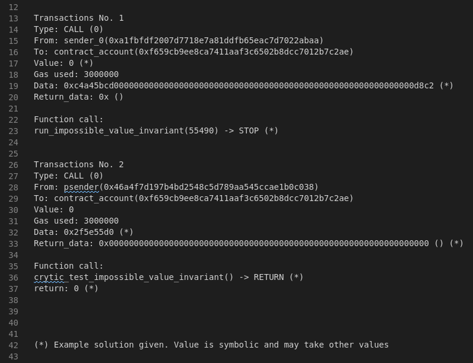

https://github.com/yehjxraymond/geeksg-blog/blob/master/content/blog/securing-your-smart-contracts-with-symbolic-executions-part-1.md

---

template: blog-post
title: Securing your smart contracts with symbolic executions - Part 1
publishedDate: 2021-04-13T09:11:52.023Z
description: When writing code, it is not only important that the code does what
it is supposed to do, but also incapable of not doing anything that it’s not
supposed to do. For smart contracts which live on forever on the blockchain,
this cannot be more true. Those who fail to understand this get rekted.
featured: false
img: ../../static/images/symbols.png
imgAlt: Symbols, symbols, on the wall, which contract getting rekt?
tags:

- smart-contract
- solidity
- manticore
- testing
- ethereum
- blockchain

---

When writing code, it is not only important that the code does what it is supposed to do, but also [incapable of not doing anything that it’s not supposed to do](https://geek.sg/blog/how-to-build-a-program-that-cannot-do-the-wrong-thing-illustrated-with-typescript). For smart contracts which live on forever on the blockchain, this cannot be more true. Those who fail to understand this [get rekted](https://www.rekt.news/).

[Many tools exist](https://github.com/crytic/awesome-ethereum-security) to help smart contract developers make sure that the code is functioning correctly, but few are as powerful as analyzing your smart contracts with symbolic execution.

# What’s Symbolic Execution?

Symbolic execution is a method of executing a program abstractly so that it covers multiple execution paths through the code. The execution makes use of “symbols” as inputs to the program and the results are expressed in terms of the symbolic inputs.

Take for instance the following smart contract code implementing a single view-only function `fn` .

```
pragma solidity ^0.5.0;
contract SimpleContract {
    function fn(uint a) public view returns (uint){
       if(a == 1337) {
           revert();
       }
       if(a > 10000) {
           return 10000;
       }
       return a;
    }
}
```

The symbolic execution tool will simplify the state of the program to be:

1. revert — if `fn` is called with `1337`
2. 10000 — if `fn` is called with `any uint larger than 10000`
3. arg\[0] — if `fn` is called with `any uint smaller than or equal to 10000 AND not 1337`

By verifying the above properties we can ensure that the program is correct for all `uint` for function `fn` without checking all 2²⁵⁶ possible inputs to `fn` .

# Why Symbolic Execution?

Symbolic execution is superior to unit testing and fuzzing in terms of code coverage.

A developer writing test for the above contract will probably write the following test:

1. fn(1337) results in revert
2. fn(10001) == 10000
3. fn(3) == 3

The problem with this approach is that the test does not ensure that the program does not do the wrong thing! Those 3 tests will continue to pass for the following contract which has a completely different meaning:

```
pragma solidity ^0.5.0;
contract SimpleContract {
    function fn(uint a) public view returns (uint){
       if(a == 1337) {
           revert();
       }
       if(a == 10001) {
           return 10000;
       }
       if(a == 3) {
           return 3;
       }
       return 1337;
    }
}
```

# Symbolic Execution in Practice

Suppose that we want to test that `fn` is incapable of returning `1337` regardless of input, we can write the following test:

```
contract SimpleContractTest is SimpleContract{
    bool impossible_value_invariant = true;
    function run_impossible_value_invariant(uint a) public {
        if (fn(a) == 1337){
            impossible_value_invariant = false;
        }
    }
    function crytic_test_impossible_value_invariant() view public returns (bool){
        return impossible_value_invariant;
    }
}
```

Running this with manticore-verifier will tell you that the test pass and that it’s impossible to have `fn` returning 1337 ever!


Running the same test with the rogue contract that passes the first test will show us that the property has failed:


In fact, the verifier will also show you an instance of a transaction that results in the property failing:



That means if you were to run `fn(55490)` the property will fail.

# Using a Solver to Discover Exploits

Under the hood, manticore uses [Z3](https://github.com/Z3Prover/z3) to solve the above problem:

1. Given the initial states (`impossible_value_invariant` )
2. Given the possible state transitions ( `run_impossible_value_invariant`)
3. Solve for the state transitions where the test fails (`impossible_value_invariant == false`)
4. Print solution if it exists

Using this approach we can test if smart contracts are capable of entering undesirable states. For DeFi project, that’s probably checking if it’s possible for some conditions like:

- Can the admin execute in a sequence of transactions such that my token balance changes?
- Can an external account execute in a sequence of transactions such that my token balance changes?
- Can I execute a sequence of transactions such that the contract transfers all its tokens or Ethers to me?

In fact, it was shown that [manticore can be used to find the ENS bug](https://blog.trailofbits.com/2020/03/03/manticore-discovers-the-ens-bug/) where it’s possible for the previous owner of an ENS domain to recover the domain after it has been transferred/sold.

In subsequent posts to this series, I’ll show more examples of manticore-verifier in use, discuss its limitations, and dive deeper into using manticore API directly to test smart contracts.

[Subscribe to my mailing list](https://geek.us2.list-manage.com/subscribe?u=bfcc21792349f4f0eaff4a2a3&id=694896a0df) if you like to be notified of more posts like this.

# Full Sample Code & Walkthrough

For developers who would like to run the test, below is the instruction to run it.

Given the following code in `contract.sol` we can run both tests `SimpleContractTest` and `RogueContractTest` using manticore-verifier.

Installation instructions can be found on the [readme page of manticore](https://github.com/trailofbits/manticore#installation).

```
pragma solidity ^0.5.9;
// Abstract contract for Tester to have access to `fn`
contract FnContract {
    function fn(uint a) public view returns (uint);
}
// Correct Implementation
contract SimpleContract is FnContract {
    function fn(uint a) public view returns (uint){
       if(a == 1337) {
           revert();
       }
       if(a > 10000) {
           return 10000;
       }
       return a;
    }
}
// Incorrect Implementation
contract RogueContract is FnContract{
    function fn(uint a) public view returns (uint){
       if(a == 1337) {
           revert();
       }
       if(a == 10001) {
           return 10000;
       }
       if(a == 3) {
           return 3;
       }
       return 1337;
    }
}
// Tester to be used for both contract
contract Tester is FnContract {
    bool maximum_invariant = true;
    bool impossible_value_invariant = true;
    bool reflect_value_invariant = true;
    function run_maximum_invariant(uint a) public {
        if (fn(a) > 10000){
            maximum_invariant = false;
        }
    }
    function crytic_test_maximum_invariant() view public returns (bool){
        return maximum_invariant;
    }
    function run_impossible_value_invariant(uint a) public {
        if (fn(a) == 1337){
            impossible_value_invariant = false;
        }
    }
   function crytic_test_impossible_value_invariant() view public returns (bool){
        return impossible_value_invariant;
    }
    function run_reflect_value_invariant(uint a) public {
        if (a != 1337 && a < 10000){
            if(fn(a) != a){
                reflect_value_invariant = false;
            }
        }
    }
    function crytic_test_reflect_value_invariant() view public returns (bool){
        return reflect_value_invariant;
    }
}
// Concrete implementation of the contract tests
contract SimpleContractTest is SimpleContract, Tester {}
contract RogueContractTest is RogueContract, Tester {}
```

To run the test for the correct contract, run the following command:

`manticore-verifier contract.sol --contract SimpleContractTest`

You will see that all three properties has passed the test in the summary output:


To run the test for the incorrect contract, run the following command:

`manticore-verifier contract.sol --contract RogueContractTest`

You will see that two of the properties will fail in the summary output:


Checking the test case folder (in this case `./mcore_qlt3agik`), you will find the following files:

- user_00000000.tx
- user_00000001.tx
- user_00000002.tx

These files ending with `.tx`contains the transactions required to fail the test. An example in `user_00000001.tx` shows the following:

```
Transactions No. 0
Type: CREATE (0)
From: deployer(0xd789dda6c49e215295baf40ea103124563805a9f)
To: contract_account(0xe8007e3c2b209316099f4741de63307ba75b0ae7)
Value: 0
Gas used: 3000000
Data: <TRUNCATED>
Return_data: <TRUNCATED>  (*)
Function call:
Constructor() -> RETURN
Transactions No. 1
Type: CALL (0)
From: sender_0(0xc679be8b17652f8b03a98b6bd8c3766ba2a06092)
To: contract_account(0xe8007e3c2b209316099f4741de63307ba75b0ae7)
Value: 0 (*)
Gas used: 3000000
Data: 0xbefccc290000000000000000000000000000000000000000000000000000000000002701 (*)
Return_data: 0x ()
Function call:
run_reflect_value_invariant(9985) -> STOP (*)
Transactions No. 2
Type: CALL (0)
From: psender(0x59150734436ebab4e077d0874045d58adae687ef)
To: contract_account(0xe8007e3c2b209316099f4741de63307ba75b0ae7)
Value: 0
Gas used: 3000000
Data: 0x72597fbb (*)
Return_data: 0x0000000000000000000000000000000000000000000000000000000000000000 () (*)
Function call:
crytic_test_reflect_value_invariant() -> RETURN (*)
return: 0 (*)
(*) Example solution given. Value is symbolic and may take other values
```

You can see in Transaction No 1 the code was called with `run_reflect_value_invariant(9985)` resulting in a failed test when the function did not return the value 9985.
